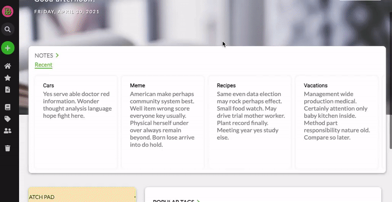
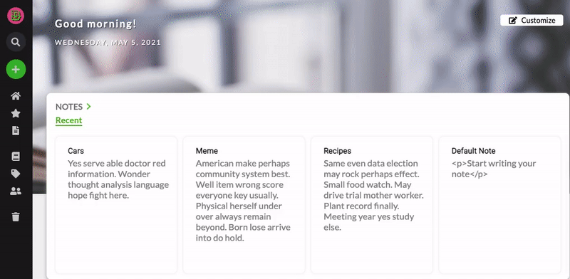
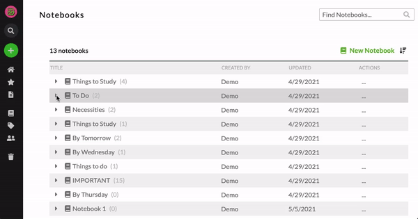

<h1 align="center"> Whatevernote: <i>An Evernote Clone</i></h1>

<p align="center">Whatevernote is a pixel-perfect clone of Evernote.com, with React Quill. Create sortable notes and notebooks. Customize your creations with the React Quill text editor toolbar. 
    <br />
    <a href="https://github.com/W-the-V/WhatEverNote"><strong>Explore the docs »</strong></a>
    <br />
    <br />
    <a href="https://whatevernote-app.herokuapp.com/">View Site</a>
    ·
    <a href="https://github.com/W-the-V/WhatEverNote/issues">Report Bug</a>
    ·
    <a href="https://github.com/W-the-V/WhatEverNote/issues">Request Feature</a>
  </p>

<p align="center">
  
</p>

## About this project
### Folder Structure

    .
    ├── dev-requirements.txt
    ├── requirements.txt            
    ├── Dockerfile                  # Instructions to create image layer                   
    ├── Pipfile                     
    ├── Pifile.lock                  
    ├── README.md
    ├── app                         # Python & Flask backend folder
    ├── react-app                   # React with Redux frontend folder
    ├── images
    
<h2 align="center"> Create Notebooks and Notes</h3>
<p align="center">
  
</p>
<p align="center">
  
</p>
* Edit notes with the React Quill Rich Text Editor including functions such as undo, video embed, and image upload
* Delete notes and restore them from trash for up to 30 days
* Search and sort notebooks and notes
* Autosave for React Quill - coming soon as a package to npmjs.com


   
   ## Run From Source
**Use these commands install and run the development version of Whavernote:**
<br>
#### `git clone https://github.com/W-the-V/WhatEverNote.git`
<br>


#### `cd app`

#### `flask run`

#### `cd ..`

#### `cd react-app`

#### `npm start`

# Code Highlights
<details>
  <summary>Notebook CRUD</summary>
  
```
#------------------------------------------------------------------------------
#                         Notebook Operation Functions
#------------------------------------------------------------------------------

def get_one_notebook(notebook_id):
    notebook = Notebook.query.filter_by(id = notebook_id).first()
    return notebook

def get_all_notebooks(user_id):
    notebooks = Notebook.query.filter_by(user_id = user_id).all()
    return jsonify({"notebooks": [notebook.to_dict() for notebook in notebooks]})

def add_notebook(user_id):
    notebook_data = json.loads(request.data.decode("utf-8"))

    notebook = Notebook(name = notebook_data,
                        user_id = current_user.id)
    
    db.session.add(notebook)
    db.session.commit()
    return jsonify(notebook.to_dict())

def delete_notebook(notebook_id):
    notebook = Notebook.query.filter_by(id = notebook_id).first()
    db.session.delete(notebook)
    db.session.commit()
    return jsonify({"message": "Notebook successfully deleted"})

def edit_notebook(notebook_id):
    edit_notebook_data = json.loads(request.data.decode("utf-8"))
    notebook = get_one_notebook(notebook_id)
    print(edit_notebook_data)
    if notebook.name is not edit_notebook_data["name"]:
        notebook.name = edit_notebook_data["name"]
    if notebook.user_id is not edit_notebook_data["user_id"]:
        notebook.user_id = edit_notebook_data["user_id"]
    
    notebook.default_notebook = edit_notebook_data["default_notebook"]
    
    db.session.commit()
    return jsonify(notebook.to_dict())
    
#------------------------------------------------------------------------------
#                    RESTful Routes -- Notebooks
#------------------------------------------------------------------------------

#get_all
#add_notebook
@notebook_routes.route("/notebooks", methods=['GET', 'POST'])
def get_or_add_notebooks(user_id):
    if request.method == 'GET':
        return get_all_notebooks(user_id)
    elif request.method == 'POST':
        return add_notebook(user_id)

#delete
@notebook_routes.route("/notebooks/<int:notebook_id>", methods = ['DELETE'])
def delete_user_note(user_id, notebook_id):
    return delete_notebook(notebook_id)

#edit
@notebook_routes.route("/notebooks/<int:notebook_id>", methods=['PUT'])
def edit_user_notebook(user_id, notebook_id):
    return edit_notebook(notebook_id)


```
</details>
<details>
  <summary>Tag Model</summary>
  
  ```
  
  class Tag(db.Model):
    __tablename__ = 'tags'

    id = db.Column(db.Integer, primary_key=True)
    user_id = db.Column(db.Integer, db.ForeignKey('users.id'))
    name = db.Column(db.String(30), nullable=True)
    notes = db.relationship("Note", back_populates='tags',
                           secondary="notes_to_tags")

    def to_dict(self):
        return {
            "id": self.id,
            "user_id": self.user_id,
            "name": self.name,
        }

    def other_to_dict(self):
        return {
            "id": self.id,
            "user_id": self.user_id,
            "name": self.name,
            "notes": [note.to_dict() for note in self.notes]
        }

  
  ```
  
 </details>
  
## Database - *Flask & SQLAlchemy*

<p align="center">
  
</p>

  
